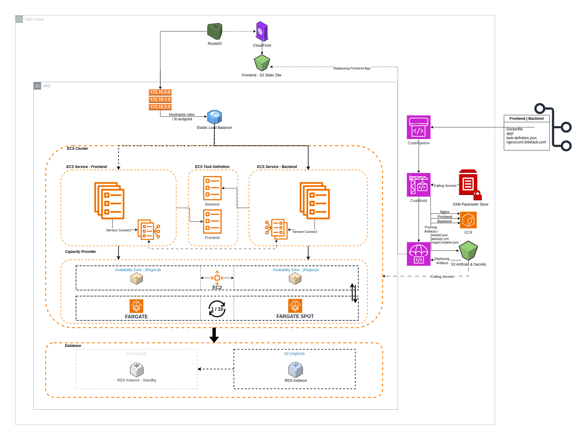

# ECS Dynamic Infrastructure Setup with Fargate, EC2, and CICD Integration using Terraform

# Architecture

The entire setup is implemented using Terraform.

# Table of Contents
- [ECS Dynamic Infrastructure Setup with Fargate, EC2, and CICD Integration using Terraform](#ecs-dynamic-infrastructure-setup-with-fargate-ec2-and-cicd-integration-using-terraform)
- [Architecture](#architecture)
- [Table of Contents](#table-of-contents)
- [Overview](#overview)
- [How to Deploy](#how-to-deploy)
  - [Pre-Deployment](#pre-deployment)
  - [Post-Deployment](#post-deployment)
- [Brief ECS Concepts](#brief-ecs-concepts)
  - [Cluster](#cluster)
  - [Namespace](#namespace)
  - [Task Definition Manifest](#task-definition-manifest)
  - [Scheduler](#scheduler)
- [How ECS Workflow Works](#how-ecs-workflow-works)
  - [Using CICD](#using-cicd)
- [Infrastructure as Code](#infrastructure-as-code)
  - [VPC](#vpc)
  - [ECS](#ecs)
    - [Common resources](#common-resources)
    - [FARGATE](#fargate)
    - [EC2](#ec2)
    - [Task Definition](#task-definition)
  - [Load Balancing](#load-balancing)
  - [CI / CD](#ci--cd)
    - [CodeBuild](#codebuild)
    - [CodeDeploy](#codedeploy)
    - [CodePipeline](#codepipeline)
    - [CloudFront with S3](#cloudfront-with-s3)
  - [Artifacts \& Secrets](#artifacts--secrets)
- [Troubleshooting](#troubleshooting)
  - [📝 License](#-license)

# Overview

This setup provides a dynamic ECS infrastructure using both Fargate and EC2. It supports single-tier and two-tier architectures, Service Connect, and load balancers with hostname rules.

It is integrated with CI/CD pipelines for inplace deployment (when using Service Connect) and blue/green deployment strategies, as well as automated Nginx server proxy setup via CI.

It allows customization of infrastructure resources with existing ones. It also supports pulling code from a Git repository, including custom Nginx configuration and task definition files, or using public Docker images directly. 

It supports volume storage of different types for CICD deployments. It also supports ARM64 architecture.

The entire setup is implemented using Terraform.

# How to Deploy

Modify the variables.tf file as instructed in the descriptions and based on how you want your application to be deployed. For further resource related changes, you have to modify the resource from the terraform code directly.

## Pre-Deployment

To run frontend application using ECS service, a hostname will be created for both of backend and frontend tiers and get assigned in the application load balancer that will have SSL certificate used instead of cloudfront(cloudfront works only for frontend as S3 or backend ecs with load balancer):
1. Create route53 hostzone and add domain name to it. 
2. Create ACM certificate and add it to the route53 hostzone.

To add secrets and envrionment variables for the ecs application, you can use the ssm resource in the source code for that.
1. Add Secrets to SSM Parameters using a specific Parameter Path. e.g. '/ENV/APP/PARAMETER'
2. The ssm parameter path will be added in the variables.tf file.

## Post-Deployment

1. In order to complete the CICD step, connet the codestart connect authentication with the respository provider from aws codepipeline, settings, then connect from the dashboard.
2. Release the codepipeline for Backend to push code to ECR and update the ECS service.
3. Release the codepipeline for Frontend to push code to S3 or ECS.

# Brief ECS Concepts

AWS Elastic Container service (ECS) is a container orchestration cloud service hosted by AWS. Similar to Kubernetes, it follows a number of concepts that schedule Tasks (Pods), manage them through a service (Deployment manifest), and allocates an IP address using the awsvpc network mode which is a container network interface (CNI) like mechanism.

AWS ECS Depends on the following layers:

## Cluster
start executionon_parameters.html#task_size).

2. EC2: It uses self managed servers by the user including the autoscaling group, autoscaling strategies, the instance type, and EC2 launch configuration related requirements.

Both types support *spot instance* deployment. Both can be used together by defining the deployment proportion and priority of scalability between them, which related to as [**Capacity Provider**](https://docs.aws.amazon.com/AmazonECS/latest/developerguide/create-capacity-provider-console-v2.html).

**B. Capacity Provider**

Applications in containers require compute resources to run them, defining scalability strategy of the resources running these containers, including the types, amount of scalability, and proportion of deployment comparing to each type of these compute resources is referred as capacity providers.

By default, AWS provides Fargate and Fargate Spot(Similar to EC2 Spot instances, which are free capacities avaialble in AWS datacenters and rented on less rate than on demand. but interruptable.) capacity providers. On the other hand, it is allowed to create an EC2 based capacity provider that uses basic or spot instances depending on how the EC2 autoscaling group is configured.

When creating an ECS service, we can define the deployment strategy based on either the *Launch Type* or the [*Capacity Providers strategy*](https://docs.aws.amazon.com/AmazonECS/latest/APIReference/API_CapacityProviderStrategyItem.html), where we can assign a an auotscalability strategy that states how many instances to launch and on which Cluster Type to launch them,based on a decided proportion. 

For example, as used in this project, it is possible to allow the deployment of a single task running by FARGATE SPOT type and keep it as minimum (Base) with priority of 10 (Weight), then it will use FARGATE that has no minmum desired capacity (Base = 0) with less priotity (Weight = 1), in this case a task will be depoyed on FARGATE after each 10 tasks deployed on FARGATE SPOT so the proportion of FARGATE_SPOT to FARGATE is (10/1).

It's also possible to use a single capacity provider, or create an EC2 autoscaling group as a capacity provider and use it instead of Fargate type - both can not be used together.

Cluster capacity providers can be modified after creation for both of Fargate and EC2. While ECS servcies can use the available capacity providers assigned to the cluster.

## Namespace

A method to group services together in a single network so they can connect with each other locally. There are two ways for services to connect with each other locally:
1. Service Connect
2. Service Discovery

Both have advantages and disadvantages based on the way [how](https://docs.aws.amazon.com/AmazonECS/latest/developerguide/interconnecting-services.html) each method maps DNS names to tasks and maintaining them. Service Connect is generally recommended as it is integrated with different types of networks more than Service Discovery.

## Task Definition Manifest

Task definition is a *json* type script that defines the images that will run in a Task. This includes the compute capacity required, volumes, secret files and environment variables, port mapping and network type. It's similar to a docker-compose.yml or Pod manifest file scripts.

## Scheduler

To run an ECS application in a cluster, we need a scheduler that uses the task definition defined. A scheduler acts as a Container management tool which makes sure that the application is sheduled to run when requested. There are [three](https://docs.aws.amazon.com/AmazonECS/latest/developerguide/scheduling_tasks.html) types:

1. Service: Used to run a task and manage its network connectivity and autoscalability, it is used for long running applications that are maintained to not stop and repair itself in case of any downtime. Think about it as a Deployment manifest in K8s.

2. Standalone Task: Used to run an application on demand, for a short time period. Typical for batch jobs that would run once called, or when an execution required to run for a longer time than a random serverless function - like lambda, which has 15 min runtime limitation.

3. Scheduled Task: This is similar to the second type, but scheduled based on time event. This is mainly configured using AWS EventBridge.
   

# How ECS Workflow Works

Basically, ECS application runs in the following workflow:

1. A Task Definition is created with the docker registry image sources mentioned, compute resources, volumes, secrets, and network configuration. 
2. Cluster is created with the desired capacity provider types.
3. ECS service or Task is created with the task definition version configured.

Each Task allocates public IP address that will change once the task is replaced. For this, a load balancer is used to provide a persistent endpoint and allow autoscaling between tasks.

## Using CICD

In CI / CD, a bit changes will differ in the way of defining the ECS components:
1. A Dockerfile or Docker Image endpoint should be ready to be used by the task definition.
2. If Dockerfile is used, then it should be pushed to a container registery like Docker or ECR.
3. A Task definition should be created previously and running by ecs service which will be used by codepipeline. After Using CI or Source code respository, the following files are prepared and used as artifacts for the CD stage based on the deployment strategy used; Blue/Green or Standard:
   1. If ECS uses standard deployment (if service connect is used then it will only will support standard deployment):
      1. A replica of the previous Task definition that includes the name and URI of the image with the "latest tag"
      2. An imagedefinition.json file that will include the image name and URI.
   2. IF ECS uses Blue/Green deployment:
      1. A replica of the previous task definition running by the ecs service (uses <TASK_DEFINITION> attibute instead of the image URL, and uses <IMAGE1> in the name value).
      2. ImageDetail.json file that defines the image name and URI.
      3. Appspec.yml file that (uses <TASK_DEFINITION> attibute instead of the image URL).
   3. Alternatively, we can use AWS CLI to deploy both strategies, this is useful especially when using third-party CI tools:
      1. Blue/Green: Requires A process to store the artifacts (task-definition.json, imageDetail.json, Appspec.yml) in S3 bucket, then call the CodeDeploy deployment gorup to update to the ECS service.
      2. ECS Standard: Register the updated task definition in ECS, then update the ECS service directly with the new task definition version. This discards the imageDefinitions.json requriement.
4. CodeDeploy(for Blue/Green) or Built-in Codepipeline( for Standard deployment) action to use the prepared artifacts.

This process will update the running service with a new deployment either using rolling deployment strategy or Blue Green strategy.

# Infrastructure as Code

## VPC

* The infrastructure allows creating VPC resources or assign a pre-created VPC through variables. The eariler has two primary subnets for the backend and frontend where each uses a seperate availability zone. 
* It includes two subnets in seperate availability zones for the database that are conditional to the creation of RDS database resource.
* It creates Internet gateway, and routes the subnets to it using route tables.
* It creates secutiry group resource that inbounds to ports assigned through `accessable_application_ports` variable. It also creates a conditional one to the RDS database, with ACL support. Similarly, it creates a security group for the application load balancer's resource  in case it was created by Terraform, which allows HTTP and HTTPS.
* It creates an SSH KeyPair for the ECS EC2 cluster, which is optional.

## ECS

There are common resources created for both the EC2 and FARGATE cluster types, and uncommon ones which are specified specifically.

### Common resources

1. Create Namespace resource, ECS cluster resource, and Task definitions resource for backend and frontend tiers.
2. The ECS cluster uses cloudwatch logs path created by terraform resource.
3. The Task definition resource is conditional to different parameters based on the variables specified. It uses `awsvpc` network, and uses a default task definition's container definitions attribute, that supports Nginx and non-Nginx images, and allows overriding the default one with a custom Task definition using the `custom_backend_task_def` local file.

### FARGATE

1. ECS cluster capacity provider resource created to define the cluster capacity providers that can be used in the cluster; which assigns FARGATE and FARGATE_SPOT, where the second is prioritised over the earlier.
   1. For a cost effecient resource, using FARGATE_SPOT alone is good if the appliaction allows occasional interruption. Currently, this setup makes a lifecycle to create one FARGATE after every 100 FARGATE SPOT tasks were deployed, using what's called capacity provider strategy.
   2. Using ARM64 with FARGATE_SPOT can help reducing further cost as well.
   3. There are two capacity provider strategies, one on cluster level, and the other on service level. The later overrides the cluster capacity provider's strategy if defined.
2. Two ECS services are created, one is primary for the backend or used as a single tier, while the second is for the frontend.
   1. By default, the service is assigned to one desired task, uses codedeploy with blue/green deployment if service connect is off, else it will use standard ECS deployment.
   2. It uses load balancer with standard target group, which will be used as blue and swapped to green target group in every new deployment in blue/green using codedeploy.
   3. For autoscalability of tasks, `app autoscaling target` resource is created, which defines the min & max task capacity, related to the ecs service.
   4. the `app autoscaling target` scales tasks out and scales in using autoscaling policies, using the `app autoscaling policy`.

### EC2

* For the EC2 cluster, a launch template prepared that uses ECS optimized AMI of the related architecture. 
* An autoscaling group created and uses this launch template.
* An EC2 capacity provider related resource is created to define the ec2 cluster by assigning the autoscaling group, and task scalability policy. This capacity provider resource is used by the ECS clsuter capacity provider.
* An ECS services created for both frontend and backend similar to FARGATE, in addtion to adding EBS volume configuration and [ordered placement strategy](https://docs.aws.amazon.com/AmazonECS/latest/developerguide/task-placement-strategies.html) added.
* App autoscaling target and app autoscaling policy are created for each service as mentioned earlier.
### Task Definition

Each tier uses its own task definition, there are two types of task definitions - blue green related and rolling update - each includes two task definitions created for each tier, one uses Nginx as a reverse proxy image for the application image, the other doesn't. Both are conditional based on the vraibles used.

The task definitions are written in th locals files.

The task definitions are made to be generated completely dynamically based on the values assigned to the terraform variables.

## Load Balancing

An application load balancer is used with two strategies:
1. For single tier: the load balancer's endpoint will be used.
2. For multi-tier: hostname rules will be used for both of the backend and frontend tiers. The hostname rules require domain name registered as Alias record assigned to the load balancer's endpoint in Route53.
3. Two target groups are created for each tier, to allow blue / green deployments.

## CI / CD

For updating the deployments to this setup, AWS CI/CD services are used:

### CodeBuild
There are two types of codebuild applications used:
   1. Nginx: deploys nginx images based on custom nginx configuration scripts, which are clonned from git repository or generated with prepared scripts that are dynamic to route to the application's port.
   2. Application (frontend/backend): This includes the ecs rolling update deploymenet or generating artifacts for codedeploy blue/green deployment.

### CodeDeploy

* For CodeDeploy Blue/Green deployment, the deployment targets the target group and swaps between TG-A and TG-B where each hosts the old/new tasks.
* When the service connect is enabled, , The ECS task definition is registered then the services are updated using rolling depoyment strategy.
* It is also possible to use CodeDeploy Standard deployment instead of updating the ECS service directly using AWS CLI.

### CodePipeline

CodePipeline is created for each tier, assigned to codebuild and codedeploy, as well as prepares codestar connection to the git repository.

### CloudFront with S3

An S3 bucket used for the frontend in case of using static website instead of ECS. It is masked by CloudFront CDN using OAC authentication.

## Artifacts & Secrets

A private and restricted S3 bucket created to store codebuild artifacts and application's environment variables and secrets. The secrets are stored by SSM paramter store and pulled by codebuild which writes them in .env file that is stored in this bucket, then used by the ECS task definition.

# Troubleshooting

- In case CodeDeploy was stuck at deploying state, it indicates an error in the deployment process. Check the ecs service deployment events, task logs (if running), and the initiated Task event logs (if was not started).
- If CodeDeploy failed the stage, check the logs and review the codebuild artifacts output.
- Any extra or irrelivent character in the task definition script could cause error in registering / deploying the task definition to the service.
- There is no way to use Fargate automatically if Fargate Spot capacity was not provided (in case of using FARGATE SPOT alone), there is a [workaround](https://www.npmjs.com/package/@wheatstalk/fargate-spot-fallback) to automate Fargate spot failover to Fargate if it fails to afford FARGATE_SPOT compute capacity.

## 📝 License

This project is licensed under the MIT License. See the [LICENSE](LICENSE) file for details.

Copyright © 2024 [Obreo](https://github.com/obreo).